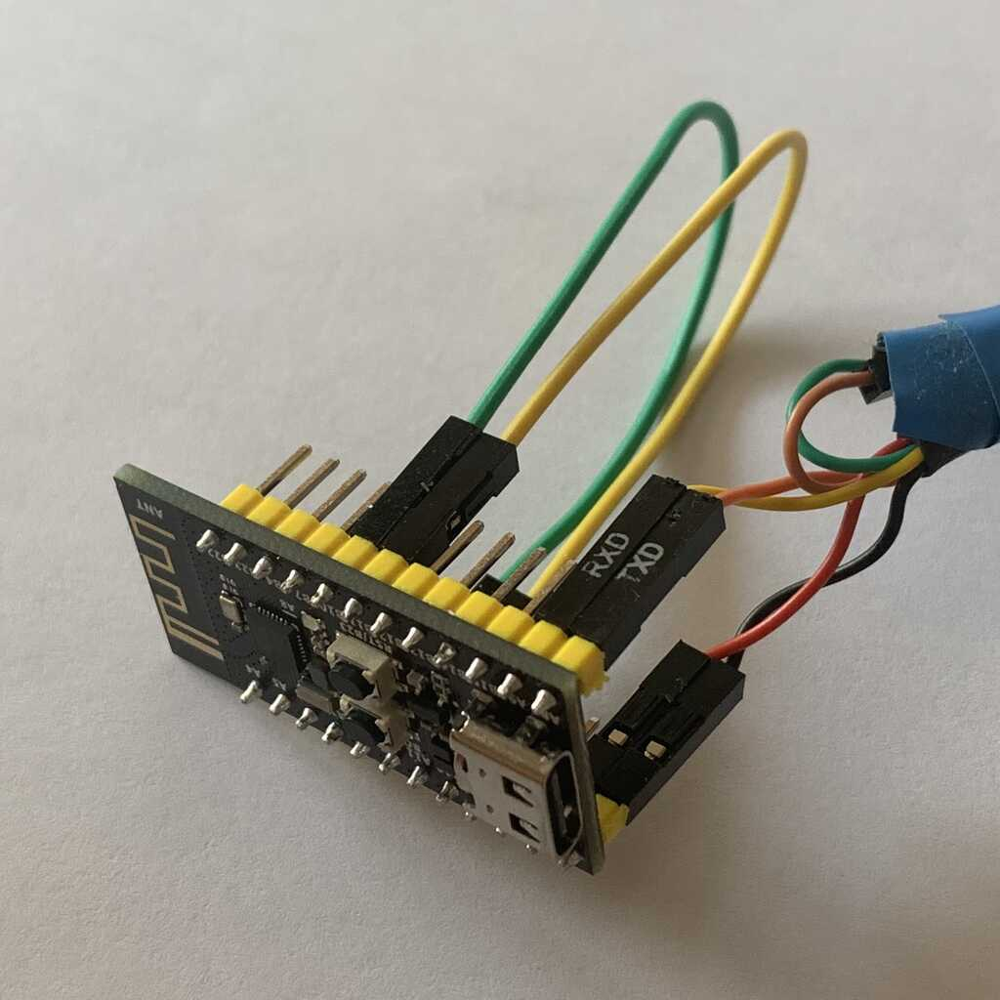

# CH582F_capture

## Demonstration of the timer capture functionality of the WCH RISC-V MCUs (CH582F, CH582M and many more)

Tested with MounRiver Studio v1.85 and a CH582F development board.

Example loopback configuration:

(PA13 <-> PB10, PA12 <-> PB11)

Expected output on UART1:

	Start @ChipID=82
	(PWM4) PA12: 1 kHz* clock output (push pull)
	(PWM5) PA13: 1 kHz* clock output (push pull)
	(TMR1) PB10: input DMA (pull up)
	(TMR2) PB11: input IRQ (pull up)
	* 1001,60 Hz
	
	running IRQ capture...
	captured edge intervals:
	/ 367,61   \ 499,20   / 499,20   \ 499,20   / 499,20   [usec]
	\ 499,20   / 499,20   \ 499,20   / 499,20   \ 499,20   [usec]
	/ 499,20   \ 499,20   / 499,20   \ 499,20   / 499,20   [usec]
	\ 499,20   / 499,20   \ 499,20   / 499,20   \ 499,20   [usec]
	/ 499,20   \ 499,20   / 499,20   \ 499,20   / 499,20   [usec]
	\ 499,20   / 499,20   \ 499,20   / 499,20   \ 499,20   [usec]
	/ 499,20   \ 499,20   / 499,20   \ 499,20   / 499,20   [usec]
	\ 499,20   / 499,20   \ 499,20   / 499,20   \ 499,20   [usec]
	/ 499,20   \ 499,20   / 499,20   \ 499,20   / 499,20   [usec]
	\ 499,20   / 499,20   \ 499,20   / 499,20   \ 499,20   [usec]
	frequency (avg.): 1001,60 Hz (error = 0,00 %)
	pausing for 5 seconds...
	
	running DMA capture...
	captured edge intervals:
	\  35,00   / 499,20   \ 499,20   / 499,20   \ 499,20   [usec]
	/ 499,20   \ 499,20   / 499,20   \ 499,20   / 499,20   [usec]
	\ 499,20   / 499,20   \ 499,20   / 499,20   \ 499,20   [usec]
	/ 499,20   \ 499,20   / 499,20   \ 499,20   / 499,20   [usec]
	\ 499,20   / 499,20   \ 499,20   / 499,20   \ 499,20   [usec]
	/ 499,20   \ 499,20   / 499,20   \ 499,20   / 499,20   [usec]
	\ 499,20   / 499,20   \ 499,20   / 499,20   \ 499,20   [usec]
	/ 499,20   \ 499,20   / 499,20   \ 499,20   / 499,20   [usec]
	\ 499,20   / 499,20   \ 499,20   / 499,20   \ 499,20   [usec]
	/ 499,20   \ 499,20   / 499,20   \ 499,20   / 499,20   [usec]
	frequency (avg.): 1001,60 Hz (error = 0,00 %)
	pausing for 5 seconds...
